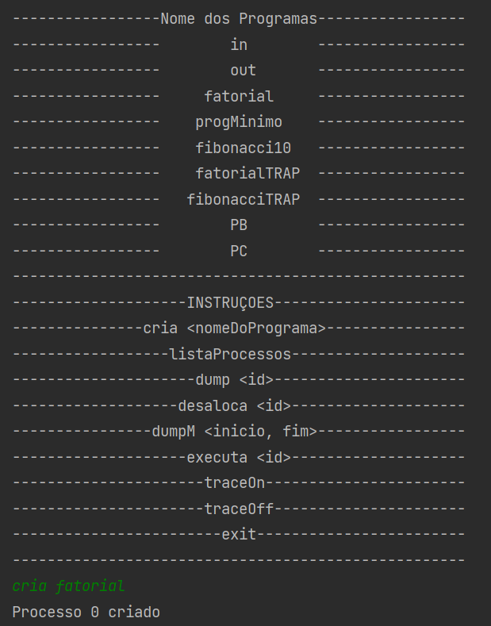
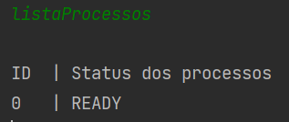
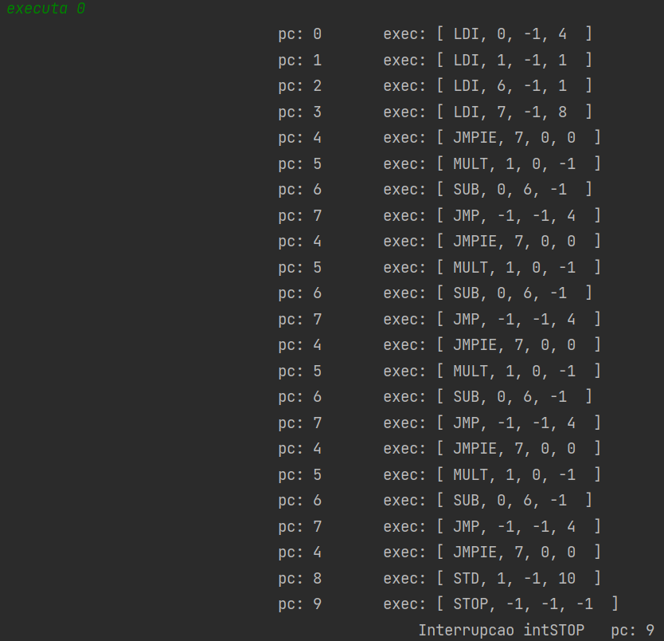
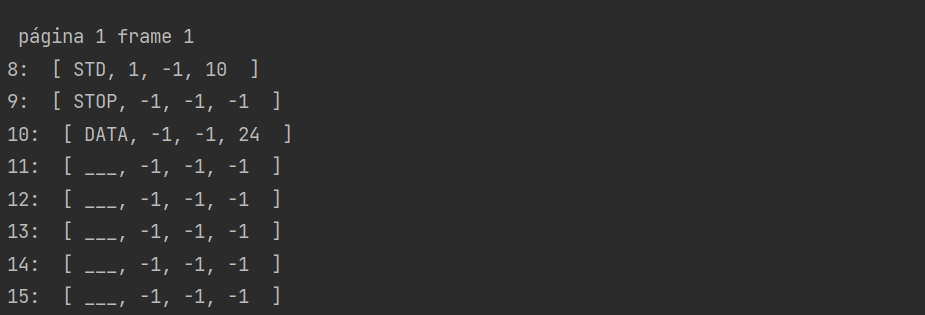
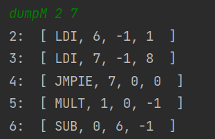

Integrantes do grupo: Aléxia J. Dorneles Pereira, Luiza Lencina, Gustavo Lottermann

## Seção Implementação:
Limitações:

- a memória ainda não é protegida por contexto, então não há proteção de acessp para os programas e nem switch para o
  modo kernel
- não há processo de escalonamento nem multiprogramação no sentido de que um processo roda até o fim e os pedidos de IO
  não o bloqueiam nem rodam outro processo
- apesar de uso de paginação, não há memória virtual e lazy/eager loading com uso de interrupção page fault

## Introdução

Para fazer a compilação do código, é preciso ter instalado o JDK em sua máquina e um compilador a escolha.

# JDK

Nós utilizamos o JDK java 19

## Para rodar o projeto

Para executar o código, primeiro enrte no arquivo src pelo comando de cd e execute o arquivo Shell.java.

```
cd src
javac Shell.java
```

após isto, run the project with:

```
java Shell
```

## Seção de Programas

Das entregas solicitadas foram implementados:

- [x] Gerente de memória com paginação
- [x] Gerente de processos

## Seção Saídas

Para criar um programa deve-se utilizar o comando "criar" e o nome do programa que deseja criar um processos, separado
espaço, como no exemplo: 


Desse forma, um processo será criado no processControlBlock e será devolvido o id desse processo. Em seguida, pode-se
utilizar o comando listaProcessos para que a lista de processos, já criados, seja printada na tela, com seus respectivos status.



Além disso, com um processo já criado, pode-se fazer a execução dele, utilizando o comando "executa" mais o id do processo que
deseja que seja executado. 



Utilizando a instrução "dump" mais o id do processo, é listado o conteúdo do PCB e o conteúdo da partição da memória do processo
com essa id. 




A instrução "dumpM" mais um número de início e um de fim, lista a memória entre essas posições. 



Para desalocar um processo do PCB, utiliza-se a instrução "desaloca" e o id do processo desejado e para finalizar o programa, 
basta utilizar o comando "exit". 